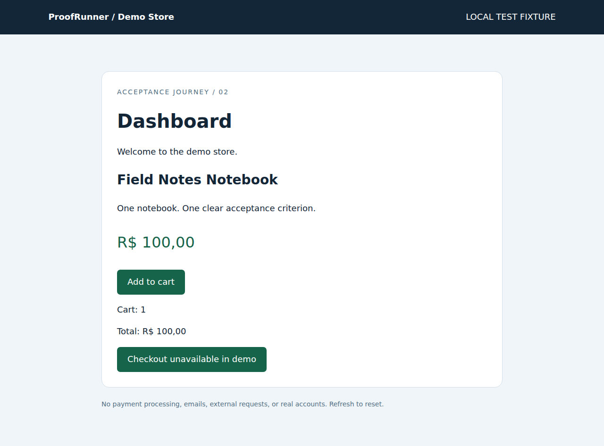

# ProofRunner

**Describe a user journey. ProofRunner runs it and gives you proof that it worked.**

Web acceptance testing in a real Chromium browser, with frozen assertions,
step screenshots, a readable report, and a replayable execution record.
Python + Playwright, with a Hermes planner for free-form instructions.

## What it does

- Plans a journey from natural language through Hermes.
- Clicks, fills test credentials, selects options, and reads the page.
- Checks exact text, URLs, visibility, enabled state, and checked state.
- Separates `PASS`, `FAIL`, `ERROR`, and `SKIPPED`.
- Writes Markdown, HTML, and JSON evidence. Stops on the first failure.
- Replays the recorded plan without spending more model tokens.

## Why it exists

A page loading is not proof that a customer can sign in or add a product.
ProofRunner connects an acceptance criterion to the action, observed outcome,
and screenshot that supports it. The model can resolve an element, but cannot
change a frozen assertion to turn a failure green.

## Quick start / demo

Requires Python 3.11–3.13 and Git. These commands run a local, disposable store:

```sh
python -m venv .venv
# Linux/macOS: source .venv/bin/activate
# Windows PowerShell: .venv\Scripts\Activate.ps1
python -m pip install -e ".[test]"
python -m playwright install chromium
proofrunner demo
proofrunner demo --broken
```

The first run should PASS. The second deliberately breaks the cart counter;
it should FAIL with evidence at step 6 and skip step 7. Exit codes: `0` pass,
`1` acceptance failure, `2` setup/safety/execution error.

The default demo uses **controlled English**, a small documented grammar, not
an LLM. This makes browser acceptance and report generation reproducible
without an API key. To test the actual Hermes planner, install/configure
Hermes and run `proofrunner demo --planner hermes`.

## Usage / example prompts

Put a free-form journey in a UTF-8 file, for example:

> Sign in using PR_TEST_USER and PR_TEST_PASSWORD. Add the Field Notes
> Notebook to the cart. Confirm the cart count is 1 and the total is R$ 100,00.
> Stop before purchase.

```sh
proofrunner run https://your-authorized-staging-site.example \
  --journey examples/journey.txt --allow-interactions
```

The `.example` URL is a placeholder; supply a real site you are authorized to
test. Free-form mode defaults to Hermes. Never put secret values in the file.
Use `PR_TEST_*` environment names; only referenced variables are read.

`--allow-interactions` authorizes form/click interactions on this one test
origin. It is not permission for real payments, purchases, account deletion,
or message sending. The default mode blocks interactions and HTTP writes.

## Output example

```text
ProofRunner Test Report
Overall: FAIL
01 PASS  fill Email
02 PASS  fill_secret Password
03 PASS  click Sign In
04 PASS  assert_visible Dashboard
05 PASS  click Add to cart
06 FAIL  assert_text cart-count — expected 1, observed 0
07 SKIPPED assert_text cart-total
```

Each run has `report.html`, `report.md`, `execution.json`, and `screenshots/`.
Open the HTML locally. Reports do not require a server or external fonts.
Actual captured examples: [PASS](examples/evidence/pass/report.html) and
[deliberate FAIL](examples/evidence/fail/report.html).

| Successful acceptance evidence | Deliberate failure detected |
|---|---|
|  |  |

```sh
proofrunner replay runs/<run-directory> --allow-interactions
```

Replay starts with a fresh browser. It does not restore cookies or database
fixtures; reset your test environment first. Built-in demo runs start their
own fresh fixture automatically.

## How it works / architecture

1. Hermes creates a schema-validated plan from the journey and expectations.
2. Playwright executes a closed set of actions in an isolated context.
3. Unknown targets can be grounded against the current accessibility snapshot.
4. Playwright evaluates assertions; the LLM never declares PASS itself.
5. ProofRunner writes evidence and the resolved locators after each step.
6. The official Agent Index client reads real Hermes usage from its store.

The planner runs Hermes with no tools. Page contents are untrusted input, and
are never evaluated as Python, shell commands, CSS, or JavaScript supplied by
the model. Browser-side JavaScript is fixed application code only.

## Installation / Docker

See [installation](docs/installation.md) for the full Hermes setup and
Windows instructions. Optional Docker route:

```sh
cp .env.example .env
docker compose build
docker compose run --rm proofrunner demo
docker compose run --rm proofrunner demo --planner hermes
```

The first build downloads Hermes and Chromium and may exceed five minutes.
No macOS, iPhone, iMessage, or Plow Latch dependency is required.

## Safety

- Use disposable test accounts on an authorized staging environment.
- Single origin only; cross-origin resources, popups, downloads, service
  workers, and WebSockets are blocked. External auth/CDNs may not work.
- Private IPs are blocked except the automatically started loopback demo.
- Potentially destructive labels/endpoints are blocked conservatively.
- Password inputs require environment references. Inputs and known secret
  echoes are masked in screenshots; known test secrets are redacted in logs.
- Safety checks reduce accidental actions; they are not a complete sandbox
  for arbitrary malicious websites. A same-origin action can have unexpected
  side effects. See [architecture](docs/architecture.md).

## Agent Index integration

Uses the official [agent-index-client](https://github.com/plow-pbc/agent-index-client),
downloaded at a fixed commit and verified by SHA-256. No replacement API or
fabricated usage. ProofRunner is registered with real Hermes usage reporting at
[AI Worth Using Agent Index](https://aiworthusing.com/agent-index/proofrunner-eduardors78).
Verified status remains a separate manual organizer review. See
[Agent Index setup](docs/agent-index.md).

## Tests / current validation

```sh
python -m pytest tests/test_core.py -q
python -m pytest tests/test_browser.py -q
python scripts/index.py self-check
```

Browser tests do not silently skip a missing browser. For the actual results,
including anything not validated in the build environment, see
[validation status](docs/validation.md).

## Troubleshooting

See [troubleshooting](docs/troubleshooting.md). No CAPTCHA solving, email
inbox integration, multifactor authentication, iframes, or cross-origin login
in this MVP. Password-recovery email retrieval is not implemented.

## License / hackathon

ProofRunner is MIT licensed. Dependencies retain their own licenses; the
downloaded official Agent Index client is Apache-2.0. No competitor code is
included. See [rules and research](docs/research.md) for the September 16,
2026 findings, ranking discrepancy, and submission gates. The agent is registered and reporting real usage. Verified status and final
prize eligibility remain decisions of the organizers.
