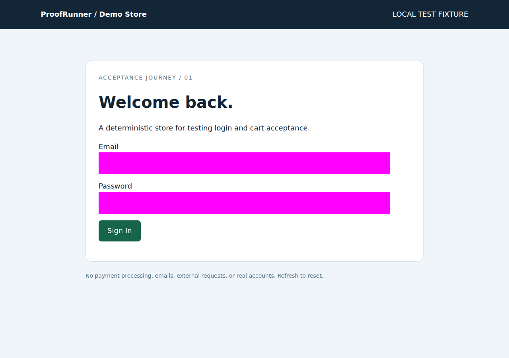
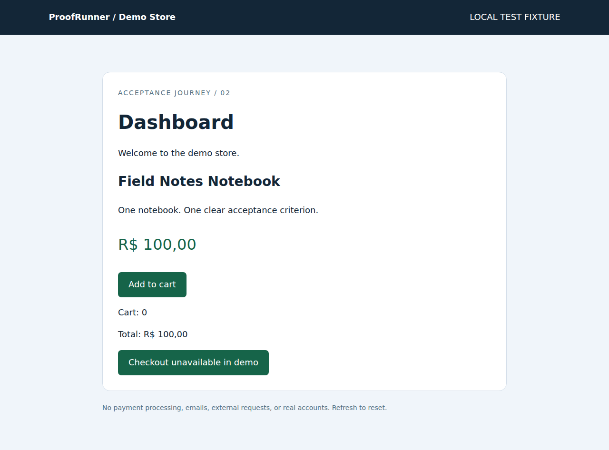

# ProofRunner Test Report

**FAIL** — Acceptance journey

Target: http://127.0.0.1:38993/
Started: 2026-09-16T02:36:14.930577+00:00
Duration: 6.01s
Planner: controlled

## Steps

### 01 · PASS · fill Email

Expected: fill
Observed: Field filled (value omitted)


### 02 · PASS · fill_secret Password

Expected: fill_secret
Observed: Field filled (value omitted)



### 03 · PASS · click Sign In

Expected: click
Observed: Click completed; see subsequent assertions for acceptance


### 04 · PASS · assert_visible Dashboard

Expected: assert_visible
Observed: Element visible


### 05 · PASS · click Add to cart

Expected: click
Observed: Click completed; see subsequent assertions for acceptance



### 06 · FAIL · assert_text cart-count

Expected: 1
Observed: Locator expected to have text '1'
Actual value: 0 
Call log:
  - Expect "to_have_text" get_by_test_id("cart-count") with timeout 5000ms
  - waiting for get_by_test_id("cart-count")
    14 × locator resolved to <span aria-label="Cart count" data-testid="cart-count">0</span>
       - unexpected value "0"

Aria snapshot:
- text: "0"


### 07 · SKIPPED · assert_text cart-total

Expected: R$ 100,00
Observed: Not executed after previous failure

## Reproduction

Replay the frozen plan (fresh browser; same test data required):

```sh
proofrunner replay <run-directory> --allow-interactions
```

Screenshots show observed state; root causes are not inferred from a failed assertion.